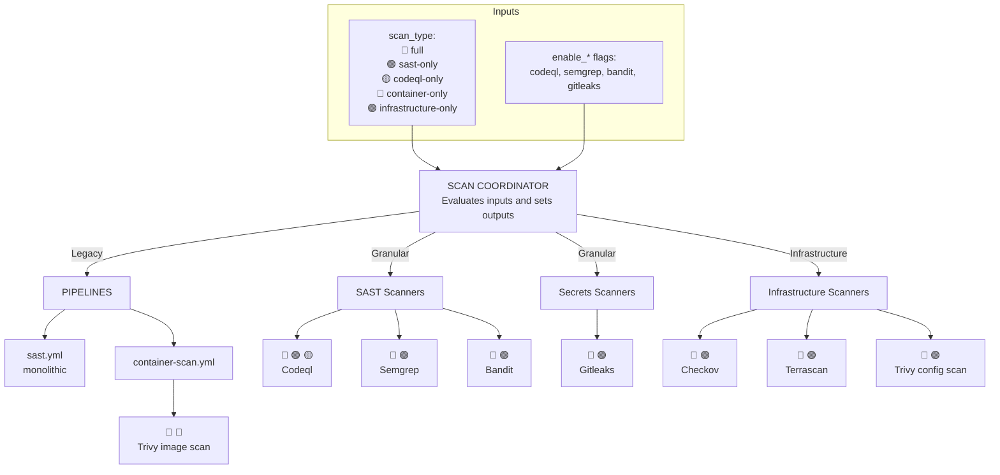
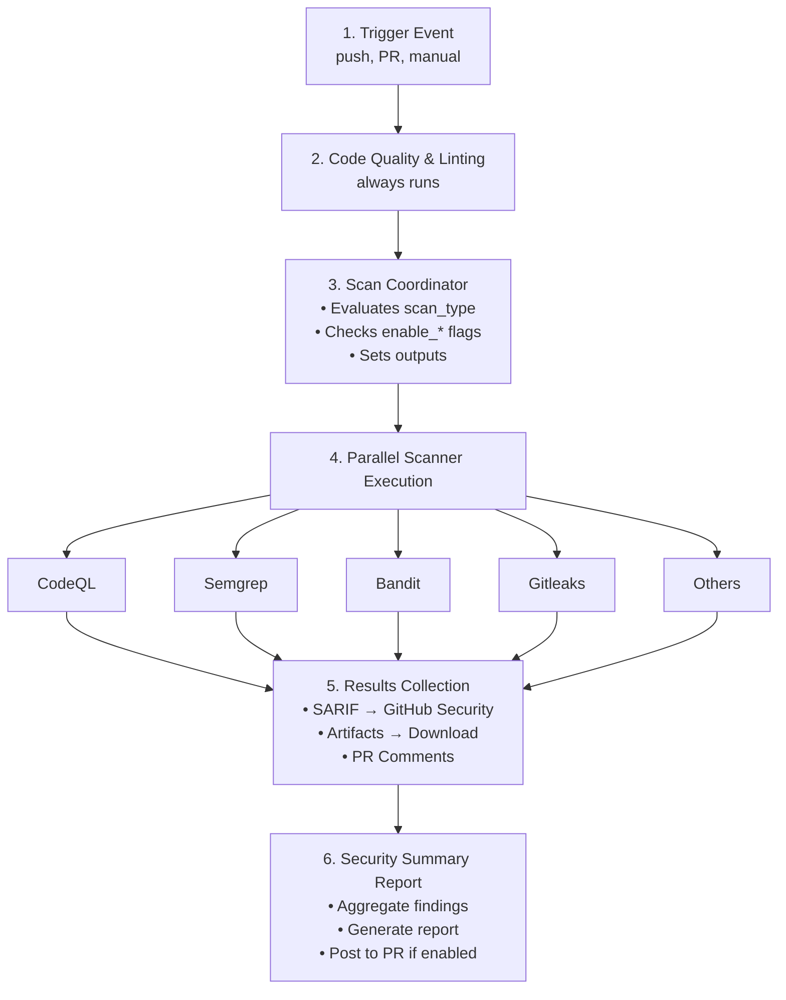

# Security Hardening Pipeline Architecture

## Overview
The Security Hardening Pipeline is designed to provide a flexible, modular, and reusable framework for integrating various security scanners into your CI/CD workflows. It supports multiple scan types, including full scans, SAST-only, container-only, and infrastructure-only scans. The pipeline is built using GitHub Actions and can be easily reused across different repositories.



**Note:** `enable_*` flags override scan type settings for granular control.

## Scanner Directory Structure

```
.github/workflows/
├── reusable-security-hardening.yml    # Main orchestrator
├── sast.yml                           # Legacy SAST pipeline (all scanners)
├── container-scan.yml                 # Container security
├── linting.yml                        # Code quality
└── scanners/                          # Modular scanner directory
    ├── README.md                      # Scanner documentation
    ├── sast/                          # Static Analysis
    │   ├── codeql.yml                 # GitHub CodeQL
    │   ├── semgrep.yml                # Semgrep/OpenGrep
    │   └── bandit.yml                 # Python Bandit
    ├── secrets/                       # Secret Detection
    │   └── gitleaks.yml               # Gitleaks
    └── infrastructure/                # Infrastructure (future)
        └── (planned: checkov, terrascan, etc.)
```

## Execution Flow


