# Security Hardening Pipeline Architecture

## Overview
The Security Hardening Pipeline is designed to provide a flexible, modular, and reusable framework for integrating various security scanners into your CI/CD workflows. It supports multiple scan types, including full scans, SAST-only, container-only, and infrastructure-only scans. The pipeline is built using GitHub Actions and can be easily reused across different repositories.

```mermaid
graph TB
    subgraph Inputs
        ST["scan_type:<br/>🔵 full<br/>🟢 sast-only<br/>🟡 codeql-only<br/>🔴 container-only<br/>🟣 infrastructure-only"]
        EF[enable_* flags:<br/>codeql, semgrep, bandit, gitleaks]
    end
    
    ST --> SC
    EF --> SC
    
    SC[SCAN COORDINATOR<br/>Evaluates inputs and sets outputs]
    
    SC --> |Legacy| PL[PIPELINES]
    SC --> |Granular| SAST_DIR[SAST Scanners]
    SC --> |Granular| SEC_DIR[Secrets Scanners]
    SC --> |Infrastructure| IF[Infrastructure Scanners]
    
    PL --> SAST[sast.yml<br/>monolithic]
    PL --> CS[container-scan.yml]
    
    SAST_DIR --> CQ["🔵 🟢 🟡<br/>Codeql"]
    SAST_DIR --> SG["🔵 🟢<br/>Semgrep"]
    SAST_DIR --> BD["🔵 🟢<br/>Bandit"]

    SEC_DIR --> GL["🔵 🟢<br/>Gitleaks"]
    
    CS --> TR1["🔵 🔴<br/>Trivy image scan"]
    IF --> CK["🔵 🟣<br/>Checkov"]
    IF --> TS["🔵 🟣<br/>Terrascan"]
    IF --> TR2["🔵 🟣<br/>Trivy config scan"]
    
```



**Note:** `enable_*` flags override scan type settings for granular control.

## Scanner Directory Structure

```
.github/workflows/
├── reusable-security-hardening.yml    # Main orchestrator
├── sast.yml                           # Legacy SAST pipeline (all scanners)
├── container-scan.yml                 # Container security
├── linting.yml                        # Code quality
└── scanners/                          # Modular scanner directory
    ├── README.md                      # Scanner documentation
    ├── sast/                          # Static Analysis
    │   ├── codeql.yml                 # GitHub CodeQL
    │   ├── semgrep.yml                # Semgrep/OpenGrep
    │   └── bandit.yml                 # Python Bandit
    ├── secrets/                       # Secret Detection
    │   └── gitleaks.yml               # Gitleaks
    └── infrastructure/                # Infrastructure (future)
        └── (planned: checkov, terrascan, etc.)
```

## Execution Flow

```mermaid
graph TD
    A[1. Trigger Event<br/>push, PR, manual] --> B[2. Code Quality & Linting<br/>always runs]
    B --> C[3. Scan Coordinator<br/>• Evaluates scan_type<br/>• Checks enable_* flags<br/>• Sets outputs]
    C --> D[4. Parallel Scanner Execution]
    
    D --> E1[CodeQL]
    D --> E2[Semgrep]
    D --> E3[Bandit]
    D --> E4[Gitleaks]
    D --> E5[Others]
    
    E1 --> F[5. Results Collection<br/>• SARIF → GitHub Security<br/>• Artifacts → Download<br/>• PR Comments]
    E2 --> F
    E3 --> F
    E4 --> F
    E5 --> F
    
    F --> G[6. Security Summary Report<br/>• Aggregate findings<br/>• Generate report<br/>• Post to PR if enabled]
```


