# Security Hardening Pipeline Architecture

## Overview
The Security Hardening Pipeline is designed to provide a flexible, modular, and reusable framework for integrating various security scanners into your CI/CD workflows. It supports multiple scan types, including full scans, SAST-only, container-only, and infrastructure-only scans. The pipeline is built using GitHub Actions and can be easily reused across different repositories.

```mermaid
graph TB
    subgraph "User Workflows"
        TRIGGER[Trigger Event:<br/>push, PR, schedule]
    end
    
    TRIGGER --> LINT[LINTING WORKFLOW<br/>linting.yml<br/>Code Quality]
    TRIGGER --> SEC_INPUT
    
    subgraph "Security Workflow Inputs"
        SEC_INPUT[reusable-security-hardening.yml]
        ST["scan_type:<br/>🔵 full<br/>🟢 sast-only<br/>🟡 codeql-only<br/>🔴 container-only<br/>🟣 infrastructure-only"]
        EF[enable_* flags:<br/>codeql, semgrep, bandit, gitleaks]
        EL[enable_linting:<br/>Optional convenience flag]
    end
    
    SEC_INPUT --> ST
    SEC_INPUT --> EF
    SEC_INPUT --> EL
    
    LINT --> LINT_TOOLS[Ruff, ESLint,<br/>Prettier, yamllint]
    
    EL --> |if true| LINT_IN_SEC[Code Quality<br/>inside security workflow]
    
    ST --> SC
    EF --> SC
    
    SC[SCAN COORDINATOR<br/>Evaluates inputs and sets outputs]
    
    SC --> SAST_DIR[SAST Scanners]
    SC --> SEC_DIR[Secrets Scanners]
    SC --> INFRA_DIR[Infrastructure Scanners]
    SC --> CONTAINER_DIR[Container Scanners]
    
    SAST_DIR --> CQ["🔵 🟢 🟡<br/>CodeQL"]
    SAST_DIR --> SG["🔵 🟢<br/>Semgrep"]
    SAST_DIR --> BD["🔵 🟢<br/>Bandit"]

    SEC_DIR --> GL["🔵 🟢<br/>Gitleaks"]
    
    CONTAINER_DIR --> TR1["🔵 🔴<br/>Trivy image scan"]
    
    INFRA_DIR --> CK["🔵 🟣<br/>Checkov"]
    INFRA_DIR --> TS["🔵 🟣<br/>Terrascan"]
    INFRA_DIR --> TR2["🔵 🟣<br/>Trivy config scan"]
    
```



**Note:** `enable_*` flags override scan type settings for granular control.

## Scanner Directory Structure

```
.github/workflows/
├── linting.yml                        # 🆕 INDEPENDENT - Code quality
├── reusable-security-hardening.yml    # 🆕 INDEPENDENT - Security only
├── sast.yml                           # Legacy SAST pipeline (all scanners)
├── container-scan.yml                 # Container security
└── scanners/                          # Modular scanner directory
    ├── README.md                      # Scanner documentation
    ├── sast/                          # Static Analysis
    │   ├── codeql.yml                 # GitHub CodeQL
    │   ├── semgrep.yml                # Semgrep/OpenGrep
    │   └── bandit.yml                 # Python Bandit
    ├── secrets/                       # Secret Detection
    │   └── gitleaks.yml               # Gitleaks
    └── infrastructure/                # Infrastructure (future)
        └── (planned: checkov, terrascan, etc.)
```

## Workflow Separation

The pipeline consists of **two independent workflows** that can be used separately or together:

### 1. Linting Workflow (`linting.yml`)
- **Purpose**: Code quality and formatting checks
- **Independent**: Can be used without security scanning
- **Scanners**: YAML, JSON, Python (Black, Ruff), Markdown, Dockerfile

### 2. Security Hardening Workflow (`reusable-security-hardening.yml`)
- **Purpose**: Security vulnerability scanning
- **Independent**: Can be used without linting
- **Scanners**: CodeQL, Semgrep, Bandit, Gitleaks, Trivy, Checkov, Terrascan
- **Optional**: Can include linting with `enable_linting: true` flag for convenience

## Design Principles

### Separation of Concerns

The pipeline separates **code quality** from **security scanning** for several reasons:

1. **Different Purposes**:
   - Linting: Code style, best practices, maintainability
   - Security: Vulnerabilities, threats, compliance

2. **Different Audiences**:
   - Linting: Developers (everyday workflow)
   - Security: Security teams, compliance officers

3. **Different Frequencies**:
   - Linting: Every commit, every PR
   - Security: Can be more selective (full scans on schedule, targeted on PR)

### Flexibility Over Prescription

The architecture supports **three approaches**:

1. **Separate Workflows** (Recommended): Call `linting.yml` and `reusable-security-hardening.yml` as independent jobs
2. **Combined Approach**: Use `enable_linting: true` flag in security workflow for simpler pipelines
3. **Security Only**: Default behavior (`enable_linting: false`) for projects with existing linting

This flexibility allows teams to choose the approach that best fits their workflow while maintaining the architectural separation.

> 📖 **For usage examples and detailed configuration**, see [`.github/workflows/README.md`](../.github/workflows/README.md)

## Execution Flow

```mermaid
graph TD
    A[1. Trigger Event<br/>push, PR, manual] --> B[2a. Code Quality & Linting<br/>OPTIONAL - separate workflow]
    A --> C[2b. Scan Coordinator<br/>• Evaluates scan_type<br/>• Checks enable_* flags<br/>• Sets outputs]
    
    B -.-> D[Linting runs independently]
    
    C --> E[3. Parallel Scanner Execution]
    
    E --> F1[CodeQL]
    E --> F2[Semgrep]
    E --> F3[Bandit]
    E --> F4[Gitleaks]
    E --> F5[Trivy/Checkov/Terrascan]
    
    F1 --> G[4. Results Collection<br/>• SARIF → GitHub Security<br/>• Artifacts → Download<br/>• PR Comments]
    F2 --> G
    F3 --> G
    F4 --> G
    F5 --> G
    
    G --> H[5. Security Summary Report<br/>• Aggregate findings<br/>• Generate report<br/>• Post to PR if enabled]
```



## Additional Resources

- 📖 [Reusing Workflows Guide](./reusing-workflows.md)
- 💡 [Example Granular Workflow](../example-granular-workflow.yml)
